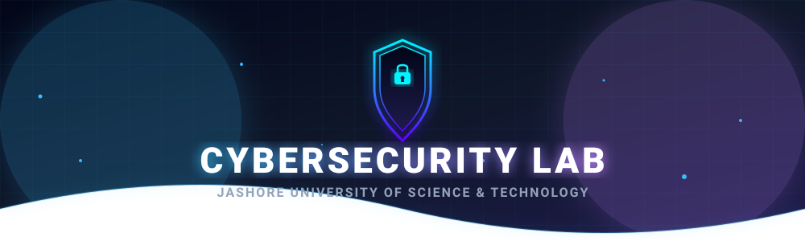

<!-- HEADER BANNER -->

<!-- TYPING ANIMATION -->

<!-- SHIELDS -->
 

 &nbsp;  &nbsp;  &nbsp; 

 

<!-- SOCIAL BADGES -->
 &nbsp;  &nbsp;  &nbsp;  &nbsp;  &nbsp; 

---

 

## 🔬 About the Lab

<table align="center">
<tr>
<td width="60%" valign="top">

Welcome to the **CyberSecurity Laboratory** at the Department of Computer Science and Engineering (CSE), **Jashore University of Science and Technology (JUST)**, Bangladesh.

Our lab is a center dedicated to advancing **research, innovation, and capacity building** in the field of modern cyber defense. In today's rapidly evolving digital landscape, ensuring the security, resilience, and reliability of networked and cyber-physical infrastructures has become more critical than ever.

We focus on developing **efficient security solutions** for emerging technologies such as smart cities, IoT-enabled infrastructures, and digital transformation initiatives. We strongly believe that combining **AI-driven analytics**, **blockchain-based trust mechanisms**, and **SDN-enabled network programmability** can significantly enhance the detection, prevention, and mitigation of cyber attacks.

</td>
<td width="40%" align="center" valign="top">

 

  

**DR. Mohammad Nowsin Amin Sheikh**

*Lab Director & Associate Professor*  
*Dept. of CSE, JUST*

 

🏅 **Gold Medalist** &nbsp;|&nbsp; 🏆 **PM Award 2012**

</td>
</tr>
</table>

---

## 🎯 Research Domains

 

<table>
<tr>
<td align="center" width="200">
 

  
<b>Software-Defined Networking</b>
  
SDN Security · Network Programmability · OpenFlow
  
</td>
<td align="center" width="200">
 

  
<b>Attack Detection & Mitigation</b>
  
DDoS Detection · IDS/IPS · Threat Intelligence
  
</td>
<td align="center" width="200">
 

  
<b>Blockchain Technologies</b>
  
Trust Mechanisms · Smart Contracts · DeFi Security
  
</td>
</tr>
<tr>
<td align="center" width="200">
 

  
<b>Artificial Intelligence</b>
  
Deep Learning · ML-driven Analytics · Anomaly Detection
  
</td>
<td align="center" width="200">
 

  
<b>Cyber-Physical Systems</b>
  
IoT Security · Smart Cities · ICS/SCADA Protection
  
</td>
<td align="center" width="200">
 

  
<b>Digital Transformation</b>
  
Cloud Security · Cyber Resilience · Zero Trust
  
</td>
</tr>
</table>

---

## 📊 Lab at a Glance

 

&nbsp;&nbsp;

&nbsp;&nbsp;

&nbsp;&nbsp;

  

---

## 📄 Selected Publications

 

> [!NOTE]
> Below is a curated selection. For the full list, visit our [Google Scholar](https://scholar.google.com/citations?user=wQd_kLUAAAAJ&hl=en) or [ResearchGate](https://www.researchgate.net/profile/Mohammad-Nowsin-Sheikh) profiles.

<table>
<thead>
<tr>
<th align="left">📌 Title</th>
<th align="center">Type</th>
<th align="center">Year</th>
<th align="center">Venue</th>
</tr>
</thead>
<tbody>
<tr>
<td><b>Intelligent DDoS Attack Detection in SDN Using Machine Learning</b></td>
<td align="center"></td>
<td align="center">2024</td>
<td align="center"><i>IEEE Trans. Network & Service Management</i></td>
</tr>
<tr>
<td><b>Blockchain-based Trust Management for IoT Security in Smart Cities</b></td>
<td align="center"></td>
<td align="center">2023</td>
<td align="center"><i>IEEE ICC</i></td>
</tr>
<tr>
<td><b>Cyber-Physical Systems Security: Comprehensive Survey of Threats & Countermeasures</b></td>
<td align="center"></td>
<td align="center">2023</td>
<td align="center"><i>Computers & Security (Elsevier)</i></td>
</tr>
<tr>
<td><b>AI-Driven Network Intrusion Detection Using Deep Neural Networks in SDN</b></td>
<td align="center"></td>
<td align="center">2022</td>
<td align="center"><i>ACM CCS</i></td>
</tr>
</tbody>
</table>

 

---

## 🧑‍🔬 Team Structure

 

<table>
<tr>
<td align="center" width="170">
 

  
<b>Lab Director</b>
 
Dr. M.N.A. Sheikh
  
</td>
<td align="center" width="170">
 

  
<b>Faculty</b>
 
Professors & Lecturers
  
</td>
<td align="center" width="170">
 

  
<b>Grad Researchers</b>
 
PhD & MS Students
  
</td>
<td align="center" width="170">
 

  
<b>Undergrads</b>
 
BSc Researchers
  
</td>
</tr>
</table>

 

---

## 🛠️ Technologies & Tools

 

  

---

## 🤝 Collaborate With Us

 

We welcome collaboration from **researchers, students, industry partners, and policymakers** to foster knowledge sharing and real-world problem solving. We are committed to nurturing young researchers, promoting ethical cybersecurity practices, and contributing to national and global cybersecurity resilience.

 

<table>
<tr>
<td align="center" width="250">

**📧 Email**

[cybersecurity@just.edu.bd](mailto:cybersecurity@just.edu.bd)

</td>
<td align="center" width="250">

**📞 Phone**

[+880 1714-492550](tel:+8801714492550)

</td>
<td align="center" width="250">

**📍 Location**

Dept. of CSE, JUST  
Jashore-7408, Bangladesh

</td>
</tr>
</table>

 

&nbsp;&nbsp;

&nbsp;&nbsp;

---

 

> *"Excellence in research, innovation in cybersecurity, and dedication to shaping the future of digital security."*  
> **— Dr. Mohammad Nowsin Amin Sheikh**, Lab Director

 

<!-- ACTIVITY GRAPH -->

 

<!-- STATS -->

&nbsp;

  

<!-- VISITORS COUNTER -->

  

<!-- FOOTER WAVE -->

